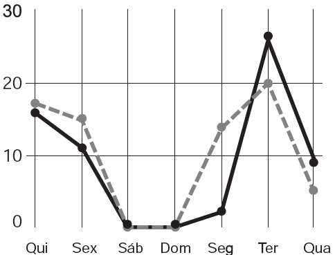

     A figura a seguir apresenta dois gráficos com informações sobre as reclamações diárias recebidas e resolvidas pelo Setor de Atendimento ao Cliente (SAC) de uma empresa, em uma dada semana. O gráfico de linha tracejada informa o número de reclamações recebidas no dia, o de linha contínua é o número de reclamações resolvidas no dia. As reclamações podem ser resolvidas no mesmo dia ou demorarem mais de um dia para serem resolvidas.

     O gerente de atendimento deseja identificar os dias da semana em que o nível de eficiência pode ser considerado muito bom, ou seja, os dias em que o número de reclamações resolvidas excede o número de reclamações recebidas.

Disponível em: http://blog.bibliotecaunix.org. Acesso em: 21 jan. 2012 (adaptado).

O gerente de atendimento pôde concluir, baseado no conceito de eficiência utilizado na empresa e nas informações do gráfico, que o nível de eficiência foi muito bom na

- [ ] segunda e na terça-feira.
- [x] terça e na quarta-feira.
- [ ] terça e na quinta-feira.
- [ ] quinta-feira, no sábado e no domingo.
- [ ] segunda, na quinta e na sexta-feira.

O nível de eficiência foi muito bom nos pontos da linha contínua que estão acima dos pontos da linha tracejada. Isso aconteceu na terça-feira e na quarta-feira.
