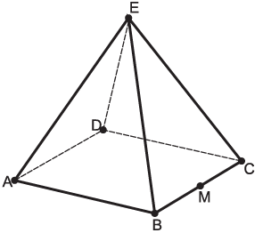
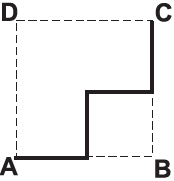
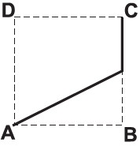
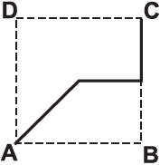
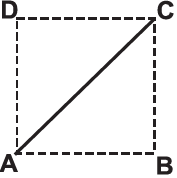
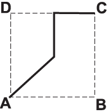
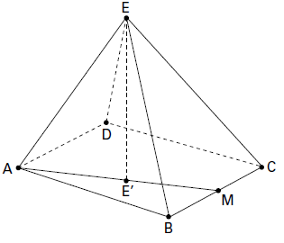
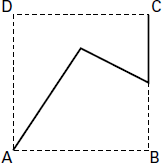

     João propôs um desafio a Bruno, seu colega de classe: ele iria descrever um deslocamento pela pirâmide a seguir e Bruno deveria desenhar a projeção desse deslocamento no plano da base da pirâmide.

O deslocamento descrito por João foi: mova-se pela pirâmide, sempre em linha reta, do ponto A ao ponto E, a seguir do ponto E ao ponto M, e depois de M a C.

O desenho que Bruno deve fazer é

- [ ] 
- [ ] 
- [x] 
- [ ] 
- [ ] 

Se a pirâmide for regular, temos como resposta a alternativa **C**.

Se a pirâmide não for regular, a projeção (ortogonal) E‘ do vértice E sobre a base pode pertencer ao segmento $\overline{AM}$ . Nesse caso, temos como resposta a alternativa **B**.

Dentre as alternativas apresentadas, apenas B e C podem representar o desenho de Bruno. Existem, no entanto, infi nitas possibilidades para esse desenho, pois a pirâmide não foi bem descrita. Por exemplo, se a projeção ortogonal do vértice E sobre a base estiver mais próxima do lado $\overline{CD}$ do que de $​​​​\overline{AB}$ , temos o seguinte desenho:

Dessa forma, a questão não admite resposta.

        