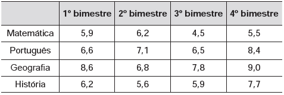
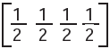
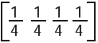
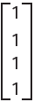
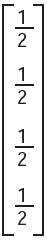

     Um aluno registrou as notas bimestrais de algumas de suas disciplinas numa tabela. Ele observou que as entradas numéricas da tabela formavam uma matriz 4x4, e que poderia calcular as médias anuais dessas disciplinas usando produto de matrizes. Todas as provas possuíam o mesmo peso, e a tabela que ele conseguiu é mostrada a seguir.

Para obter essas médias, ele multiplicou a matriz obtida a partir da tabela por

- [ ] 
- [ ] 
- [ ] 
- [ ] 
- [x] 

Como todas as provas possuíam o mesmo peso, as médias fi nais são obtidas pelas médias aritméticas das notas de cada bimestre. Assim, devemos multiplicar a matriz obtida a partir da tabela por:

