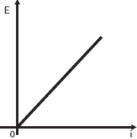
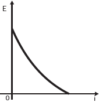
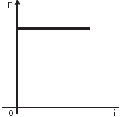
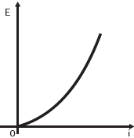
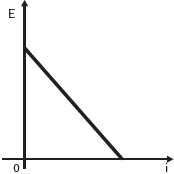

     Existem no mercado chuveiros elétricos de diferentes potências, que representam consumos e custos diversos. A potência (P) de um chuveiro elétrico é dada pelo produto entre sua resistência elétrica (R) e o quadrado da corrente elétrica (i) que por ele circula. O consumo de energia elétrica (E), por sua vez, é diretamente proporcional à potência do aparelho.

Considerando as características apresentadas, qual dos gráficos a seguir representa a relação entre a energia consumida (E) por um chuveiro elétrico e a corrente elétrica (i) que circula por ele?

- [ ] 
- [ ] 
- [ ] 
- [x] 
- [ ] 

Sendo k uma constante positiva, do enunciado, temos:

$P = R \cdot i^2$   e   $E = k \cdot R \cdot i^2$

O gráfico que melhor representa a energia em função da corrente é o da alternativa **D**.

        