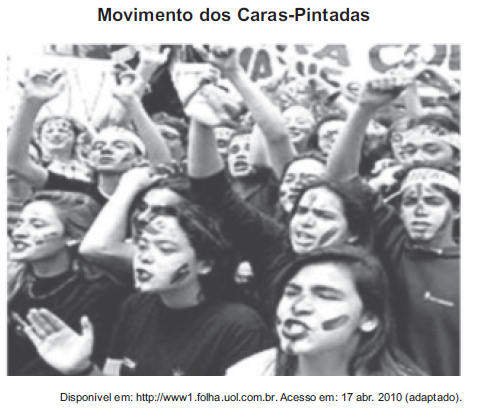

O movimento representado na imagem, do início dos anos de 1990, arrebatou milhares de jovens no Brasil. Nesse contexto, a juventude, movida por um forte sentimento cívico,

- [ ] aliou-se aos partidos de oposição e organizou a campanha Diretas Já.
- [ ] manifestou-se contra a corrupção e pressionou pela aprovação da Lei da Ficha Limpa.
- [ ] engajou-se nos protestos relâmpago e utilizou a internet para agendar suas manifestações.
- [ ] espelhou-se no movimento estudantil de 1968 e protagonizou ações revolucionárias armadas.
- [x]            processo de impeachment do então presidente Collor.

Após uma série de denúncias de corrupção que resultaram na formação de uma comissão parlamentar de inquérito, ganhou corpo uma forte pressão popular sobre o governo Fernando Collor (1990-92). Jovens que ficariam conhecidos como caras-pintadas tomaram as ruas de diversas cidades do Brasil, em defesa da ética e da transparência na condução dos interesses públicos.

        