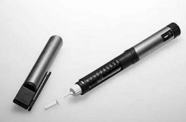

A insulina é utilizada no tratamento de pacientes com diabetes para o controle glicêmico. Para facilitar sua aplicação, foi desenvolvida uma “caneta” na qual pode ser inserido um refil contendo 3 mL de insulina, como mostra a imagem.

 

Para controle das aplicações, definiu-se a unidade de insulina como 0,01 mL. Antes de cada aplicação, é necessário descartar 2 unidades de insulina, de forma a retirar possíveis bolhas de ar.\
A um paciente foram prescritas duas aplicações diárias: 10 unidades de insulina pela manhã e 10 à noite.

Qual o número máximo de aplicações por refil que o paciente poderá utilizar com a dosagem prescrita?

- [x] 25
- [ ] 15
- [ ] 13
- [ ] 12
- [ ] 8

Em cada aplicação, serão utilizadas 12 unidades de insulina (10 como dose prescrita mais 2 para retirar as bolhas de ar). Desta forma, para cada aplicação, é necessário 0,12 mL de insulina. Assim, em um refil de 3 mL, são possíveis

 

$\frac{3 \\, mL}{0,12\\,mL} = 25 $ aplicações
