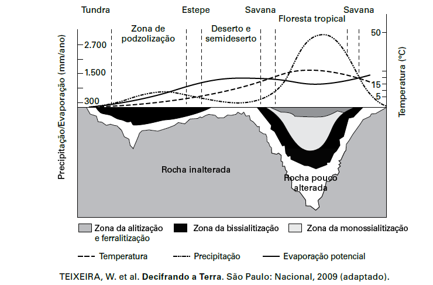

O gráfico relaciona diversas variáveis ao processo de formação de solos. A interpretação dos dados mostra que a água é um dos importantes fatores de pedogênese, pois nas áreas

- [ ] de clima temperado ocorrem alta pluviosidade e grande profundidade de solos.
- [ ] tropicais ocorre menor pluviosidade, o que se relaciona com a menor profundidade das rochas inalteradas.
- [ ] de latitudes em torno de 30° ocorrem as maiores profundidades de solo, visto que há maior umidade.
- [ ] tropicais a profundidade do solo é menor, o que evidencia menor intemperismo químico da água sobre as rochas.
- [x] de menor latitude ocorrem as maiores precipitações, assim como a maior profundidade dos solos.

O gráfico demonstra que, nas regiões de menores latitudes, mais quentes e úmidas, as rochas são mais alteradas no processo de formação dos solos (pedogênese), determinando sua maior profundidade. Elevadas temperaturas e abundância de água, características das regiões tropicais, intensificam os fatores da pedogênese, como o desgaste das rochas e a aceleração da atividade biológica, provocando a formação de solos mais profundos.

        