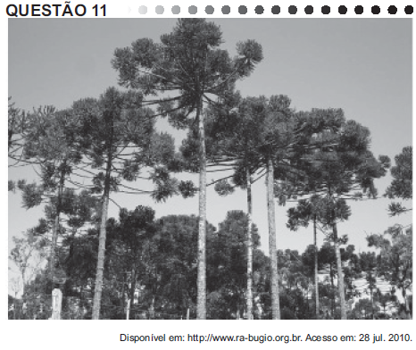

A imagem retrata a araucária, árvore que faz parte de um importante bioma brasileiro que, no entanto, já foi bastante degradado pela ocupação humana. Uma das formas de intervenção humana relacionada à degradação desse bioma foi

- [ ] o avanço do extrativismo de minerais metálicos voltados para a exportação na região Sudeste.
- [ ] a contínua ocupação agrícola intensiva de grãos na região Centro-Oeste do Brasil.
- [ ] o processo de desmatamento motivado pela expansão da atividade canavieira no Nordeste brasileiro.
- [x] o avanço da indústria de papel e celulose a partir da exploração da madeira, extraída principalmente no Sul do Brasil.
- [ ] o adensamento do processo de favelização sobre áreas da Serra do Mar na região Sudeste.

A mata das araucárias, típica do Sul do Brasil, sofreu, ao longo dos séculos XIX e XX, intenso desmatamento, ocasionado pela expansão agropecuária e crescimento das cidades. Nas últimas décadas, a exploração madeireira, voltada sobretudo para a feitura de móveis e fabricação de papel e celulose, reduziu drasticamente a extensão do bioma, sem que necessariamente tenha ocorrido a sua recuperação por meio do reflorestamento.

        