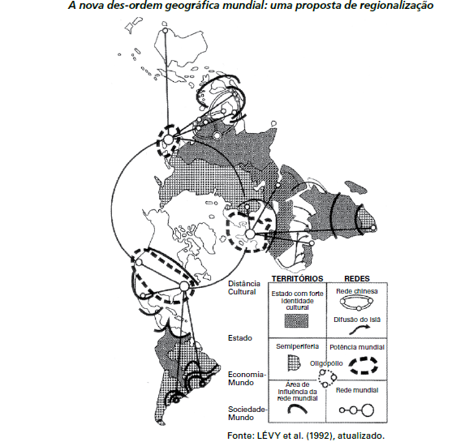

O espaço mundial sob a “nova des-ordem” é um emaranhado de zonas, redes e “aglomerados”, espaços hegemônicos e contra-hegemônicos que se cruzam de forma complexa na face da Terra. Fica clara, de saída, a polêmica que envolve uma nova regionalização mundial. Como regionalizar um espaço tão heterogêneo e, em parte, fluido, como é o espaço mundial contemporâneo?

HAESBAERT, R.; PORTO-GONÇALVES, C.W. A nova des-ordem mundial. São Paulo: UNESP, 2006.

O mapa procura representar a lógica espacial do mundo contemporâneo pós-União Soviética, no contexto de avanço da globalização e do neoliberalismo, quando a divisão entre países socialistas e capitalistas se desfez e as categorias de “primeiro” e “terceiro” mundo perderam sua validade explicativa. Considerando esse objetivo interpretativo, tal distribuição espacial aponta para

- [ ] a estagnação dos Estados com forte identidade cultural.
- [ ] o alcance da racionalidade anticapitalista.
- [x] a influência das grandes potências econômicas.
- [ ] a dissolução de blocos políticos regionais.
- [ ] o alargamento da força econômica dos países islâmicos.

Uma das características marcantes do atual ordenamento do poder mundial é o aumento do peso das grandes economias nas decisões políticas. No contexto da economia global contemporânea, calcada numa política neoliberalizante, as grandes potências econômicas centralizam o poder e influenciam suas respectivas áreas e periferias, reordenando o espaço mundial.
