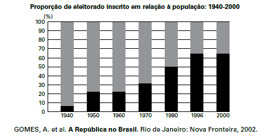

A análise da tabela permite identificar um intervalo de tempo no qual uma alteração na proporção de eleitores inscritos resultou de uma luta histórica de setores da sociedade brasileira. O intervalo de tempo e a conquista estão associados, respectivamente, em

- [ ] 1940-1950 — direito de voto para os ex-escravos.
- [ ] 1950-1960 — fim do voto secreto.
- [ ] 1960-1970 — direito de voto para as mulheres.
- [ ] 1970-1980 — fim do voto obrigatório.
- [x] 1980-1996 — direito de voto para os analfabetos.

A década de 1980 foi cenário do processo de abertura política no Brasil, com o movimento das Diretas, o fim do regime militar e a promulgação de uma nova Constituição, em 1988. Essa Constituição assegurou a participação política a todos os cidadãos brasileiros, concedendo o direito de voto aos analfabetos — o que explica o aumento da proporção de eleitores no período de 1980-1996, visto no gráfico do enunciado.
