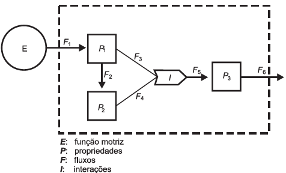

     A figura representa um dos modelos de um sistema de interações entre seres vivos. Ela apresenta duas propriedades, $P\_1$ e $P\_2$, que interagem em I, para afetar uma terceira propriedade, $P\_3$, quando o sistema é alimentado por uma fonte de energia, E. Essa figura pode simular um sistema de campo em que $P\_1$ representa as plantas verdes; $P\_2$ um animal herbívoro e $P\_3$, um animal onívoro.

ODUM, E. P. Ecologia. Rio de Janeiro: Guanabara Koogan, 1988.

A função interativa I representa a proporção de

- [ ] herbivoria entre $P\_1$ e $P\_2$.
- [ ] polinização entre $P\_1$ e $P\_2$.
- [ ] $P\_3$ utilizada na alimentação de $P\_1$ e $P\_2$.
- [x] $P\_1$ ou $P\_2$ utilizada na alimentação de $P\_3$.
- [ ] energia de $P\_1$ e de $P\_2$ que saem do sistema.

Observando o diagrama, percebe-se que a função interativa I representa a proporção de $P\_1$ e $P\_2$ utilizada na alimentação de $P\_3$, um animal onívoro.
