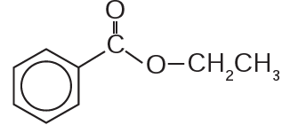
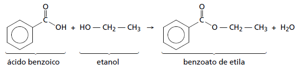

     A própolis é um produto natural conhecido por suas propriedades anti-inflamatórias e cicatrizantes. Esse material contém mais de 200 compostos identificados até o momento. Dentre eles, alguns são de estrutura simples, como é o caso do $\ce{C6H5CO2CH2CH3}$, cuja estrutura está mostrada a seguir

O ácido carboxílico e o álcool capazes de produzir o éster em apreço por meio da reação de esterificação são, respectivamente,

- [x] ácido benzoico e etanol.
- [ ] ácido propanoico e hexanol.
- [ ] ácido fenilacético e metanol.
- [ ] ácido propiônico e cicloexanol.
- [ ] ácido acético e álcool benzílico.

A reação de esterifi cação que produz a substância mencionada no texto é:

        