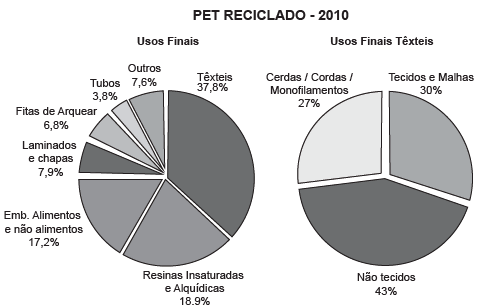

O polímero de PET (Politereftalato de Etileno) é um dos plásticos mais reciclados em todo o mundo devido à sua extensa gama de aplicações, entre elas, fibras têxteis, tapetes, embalagens, filmes e cordas. Os gráficos mostram o destino do PET reciclado no Brasil, sendo que, no ano de 2010, o total de PET reciclado foi de 282 kton (quilotoneladas).

Disponível em: www.abipet.org.br. Acesso em: 12 jul. 2012 (adaptado).

 

De acordo com os gráficos, a quantidade de embalagens PET recicladas destinadas à produção de tecidos e malhas, em kton, é mais aproximada de

- [ ] 16,0.
- [ ] 22,9.
- [x] 32,0.
- [ ] 84,6.
- [ ] 106,6.

De acordo com os gráficos, a quantidade de embalagens PET recicladas destinadas à produção de tecidos e malhas, em kt (e não kton, como está no enunciado), é

 

37,8% . 30% . 282 = 31, 9788 $\approx$ 32,00

        