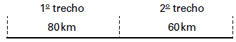

Uma empresa de transportes precisa efetuar a entrega de uma encomenda o mais breve possível. Para tanto, a equipe de logística analisa o trajeto desde a empresa até o local da entrega. Ela verifica que o trajeto apresenta dois trechos de distâncias diferentes e velocidades máximas permitidas diferentes. No primeiro trecho, a velocidade máxima permitida é de 80 km/h e a distância a ser percorrida é de 80 km. No segundo trecho, cujo comprimento vale 60 km, a velocidade máxima permitida é 120 km/h.

Supondo que as condições de trânsito sejam favoráveis para que o veículo da empresa ande continuamente na velocidade máxima permitida, qual será o tempo necessário, em horas, para a realização da entrega?

- [ ] 0,7
- [ ] 1,4
- [x] 1,5
- [ ] 2,0
- [ ] 3,0

De acordo com o enunciado, pode-se construir o seguinte esquema:

\
        $V\_{máx} = 80km/h$                    $V\_{máx} = 120km/h$

• Intervalo de tempo necessário para percorrer o 1o trecho:

$\Delta t\_1 = \cfrac{\Delta s\_1}{v\_1}$

$\Delta t\_{1} = \cfrac{80}{80}$

$\Delta t\_{1} = 1h$

• Intervalo de tempo necessário para percorrer o 2o trecho:

$\Delta t\_2 = \cfrac{\Delta s\_2}{v\_2}$

$\Delta t\_2 = \cfrac{60}{120}$

$\Delta t\_2 = 0,5h$

Logo, o tempo necessário para realizar a entrega é:

 $\Delta t\_{Total} = \Delta t\_1 + \Delta t\_2 = 1 + 0,5$

$\Delta t\_{Total} = 1,5h$

        