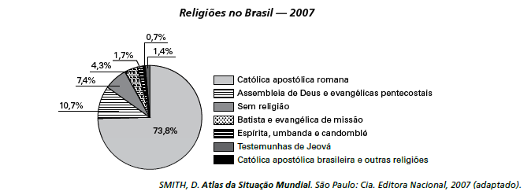

Uma explicação de caráter histórico para o percentual da religião com maior número de adeptos declarados no Brasil foi a existência, no passado colonial e monárquico, da

- [ ] incapacidade do cristianismo de incorporar aspectos de outras religiões.
- [ ] incorporação da ideia de liberdade religiosa na esfera pública.
- [ ] permissão para o funcionamento de igrejas não cristãs.
- [x] relação de integração entre Estado e Igreja.
- [ ] influência das religiões de origem africana.

A integração entre Estado e Igreja, conhecida como Padroado nos períodos Colonial e Imperial, facilitava a legitimação do regime monárquico perante a sociedade e, ao mesmo tempo, da existência de uma religião oficial, explicando a preponderância do catolicismo no território brasileiro.
