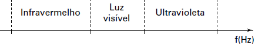

     Nossa pele possui células que reagem à incidência de luz ultravioleta e produzem uma substância chamada melanina, responsável pela pigmentação da pele. Pensando em se bronzear, uma garota vestiu um biquíni, acendeu a luz de seu quarto e deitou-se exatamente abaixo da lâmpada incandescente. Após várias horas ela percebeu que não conseguiu resultado algum.

O bronzeamente não ocorreu porque a luz emitida pela lâmpada incandescente é de

- [ ] baixa intensidade.
- [x] baixa frequência.
- [ ] um espectro contínuo.
- [ ] amplitude inadequada.
- [ ] curto comprimento de onda.

O esquema abaixo apresenta o espectro eletromagnético em função da frequência (f):

De acordo com o esquema, a luz visível emitida pela lâmpada é de frequência menor que a luz ultravioleta.
