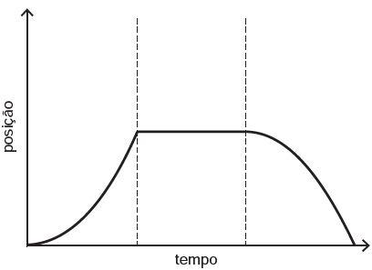
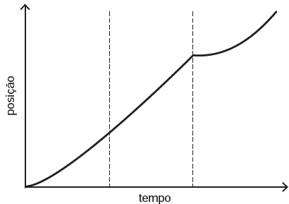
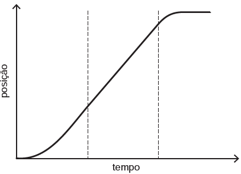
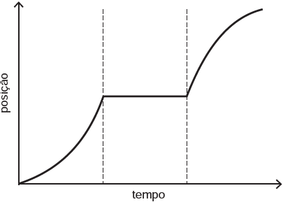
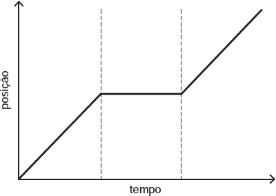
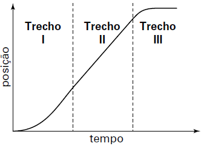

     Para melhorar a mobilidade urbana na rede metroviária é necessário minimizar o tempo entre estações. Para isso a administração do metrô de uma grande cidade adotou o seguinte procedimento entre duas estações: a locomotiva parte do repouso com aceleração constante por um terço do tempo de percurso, mantém a velocidade constante por outro terço e reduz sua velocidade com desaceleração constante no trecho final, até parar.

Qual é o gráfico de posição (eixo vertical) em função do tempo (eixo horizontal) que representa o movimento desse trem?

- [ ] 
- [ ] 
- [x] 
- [ ] 
- [ ] 

O gráfi co do espaço em função do tempo para o movimento descrito fi ca representado por:

Trecho I: um arco de parábola com concavidade para cima, pois trata-se de um movimento acelerado.

Trecho II: um segmento de reta ascendente, pois trata-se de um movimento uniforme.

Trecho III: um arco de parábola com concavidade para baixo, pois trata-se de um movimento retardado.

 

        