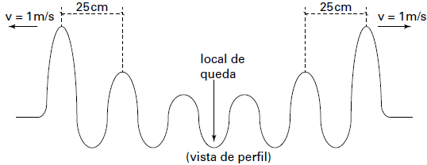

     Em um dia de chuva muito forte, constatou-se uma goteira sobre o centro de uma piscina coberta, formando um padrão de ondas circulares. Nessa situação, observou-se que caíam duas gotas a cada segundo. A distância entre duas cristas consecutivas era de 25 cm e cada uma delas se aproximava da borda da piscina com velocidade de 1,0 m/s. Após algum tempo a chuva diminuiu e a goteira passou a cair uma vez por segundo.

Com a diminuição da chuva, a distância entre as cristas e a velocidade de propagação da onda se tornaram, respectivamemente,

- [ ] maior que 25 cm e maior que 1,0 m/s.
- [x] maior que 25 cm e igual a 1,0 m/s.
- [ ] menor que 25 cm e menor que 1,0 m/s.
- [ ] menor que 25 cm e igual a 1,0 m/s.
- [ ] igual a 25 cm e igual a 1,0 m/s.

A seguir, vamos apresentar duas soluções compatíveis com a situação apresentada.

**Solução I**

Vamos admitir que a frequência de queda das gotas seja, de fato, a frequência da onda gerada. Nessa circunstância, a diminuição da frequência (de duas gotas a cada segundo para uma gota a cada segundo) acarretaria um aumento no comprimento de onda $(\lambda' = 25cm)$, uma vez que a velocidade de propagação da onda permanece inalterada, pois ela depende das características do meio.

Esse raciocínio conduziria à alternativa **B**.

Entretanto, se esse raciocínio se aplicar ao enunciado, há um dado inconsistente, pois, com a frequência de 2Hz (2 gotas por segundo) e comprimento de onda de 0,25m, a velocidade de propagação da onda $(v = \lambda \cdot f)$ seria 0,5m/s e não 1,0m/s. Tal confusão poderia prejudicar o candidato.

 

**Solução II**

A segunda possibilidade advém do fato de que, com a queda de uma única gota (por exemplo, a primeira), outras ondas são geradas pela oscilação da porção de água que recebeu o impacto da gota.

Nesse caso, a frequência de oscilação da onda não se confunde com a frequência de queda das gotas. Se assim for, a alteração na frequência de queda das gotas não alteraria a distância entre cristas consecutivas (λ), tampouco a velocidade de avanço das ondas.

Esse raciocínio conduziria à alternativa **E**.

**Comentário:** Se a segunda opção de solução for aquela adotada pela banca, poderíamos classificar essa questão como inadequada ao tipo de prova proposta, gerando um contraste acentuado com as demais questões. É tradição nos livros de Ensino Médio e nos vestibulares de boa reputação associar a frequência de impacto da fonte à porção da água e à frequência da onda.

Considerando que a solução I apresenta um dado inconsistente com os demais e que a solução II exigiria um nível de compreensão do fenômeno incompatível com o que é ensinado no Ensino Médio, a banca poderia cogitar a possibilidade de anulação dessa questão.
