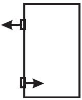

     O mecanismo que permite articular uma porta (de um móvel ou de acesso) é a dobradiça. Normalmente, são necessárias duas ou mais dobradiças para que a porta seja fixada no móvel ou no portal, permanecendo em equilíbrio e podendo ser articulada com facilidade.

No plano, o diagrama vetorial das forças que as dobradiças exercem na porta está representado em

- [ ] 
- [ ] 
- [ ] 
- [x] 
- [ ] 

Quando a porta está em equilíbrio, temos $\Sigma M_F = 0$ e $\Sigma \overrightarrow{F} = 0$. Desse modo, o desenho que representa as forças que as dobradiças exercem na porta é:

$\overrightarrow{P}$: peso da porta;\
$\overrightarrow{C\_1}$: força que a dobradiça 1 aplica na porta;\
$\overrightarrow{C\_2}$: força que a dobradiça 2 aplica na porta.

 
