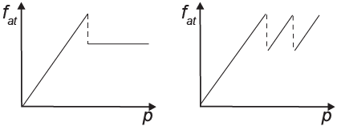
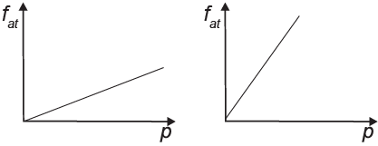
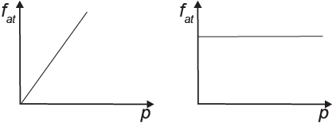
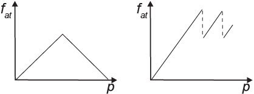
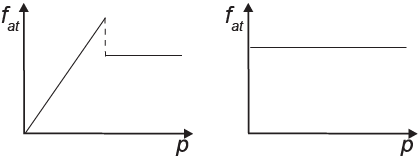

     Os freios ABS são uma importante medida de segurança no trânsito, os quais funcionam para impedir o travamento das rodas do carro quando o sistema de freios é acionado, liberando as rodas quando estão no limiar do deslizamento. Quando as rodas travam, a força de frenagem é governada pelo atrito cinético.

As representações esquemáticas da força de atrito $f\_{at}$ entre os pneus e a pista, em função da pressão p aplicada no pedal de freio, para carros sem ABS e com ABS, respectivamente, são:

- [x] 
- [ ] 
- [ ] 
- [ ] 
- [ ] 

As alternativas para esta questão sugerem que exista uma proporcionalidade direta entre $f\_{at}$ e p, desde que não haja travamento das rodas.

No momento em que ocorre o travamento, a força de atrito atinge o valor estático máximo. A partir daí, considerando que o motorista continue aumentando a pressão de frenagem, dois comportamentos são admitidos:

• se os freios não são ABS, os pneus passam a deslizar e a força de atrito neles aplicada, denominada cinética, assume um valor constante.

• se os freios são ABS, a frenagem é instantaneamente interrompida, os pneus voltam a rolar sobre a pista e a força de atrito neles aplicada assume um valor inferior ao estático máximo. No entanto, como a frenagem do veículo está sendo solicitada pelo condutor, a força de atrito volta a crescer proporcionalmente com a pressão aplicada no pedal de freio, até um novo travamento das rodas.

        