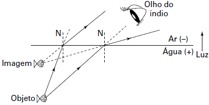

     Alguns povos indígenas ainda preservam suas tradições realizando a pesca com lanças, demonstrando uma notável habilidade. Para fisgar um peixe em um lago com águas tranquilas o índio deve mirar abaixo da posição em que enxerga o peixe.

Ele deve proceder dessa forma porque os raios de luz

- [ ] refletidos pelo peixe não descrevem uma trajetória retilínea no interior da água.
- [ ] emitidos pelos olhos do índio desviam sua trajetória quando passam do ar para a água.
- [ ] espalhados pelo peixe são refletidos pela superfície da água.
- [ ] emitidos pelos olhos do índio são espalhados pela superfície da água.
- [x] refletidos pelo peixe desviam sua trajetória quando passam da água para o ar.

De acordo com a situação apresentada, pode-se representar a trajetória de alguns raios de luz que emergem do peixe e sofrem refração ao passar para o ar:

A análise da figura acima permite concluir que os raios de luz refletidos (“emitidos”) pelo peixe desviam sua trajetória quando passam da água para o ar.
