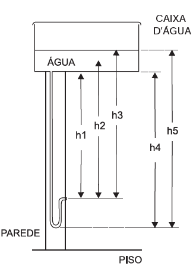
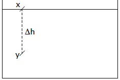
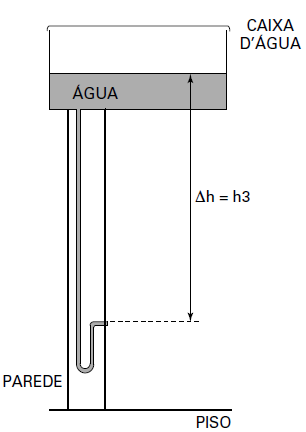

O manual que acompanha uma ducha higiênica informa que a pressão mínima da água para o seu funcionamento apropriado é de 20 kPa. A figura mostra a instalação hidráulica com a caixa d’água e o cano ao qual deve ser conectada a ducha.

O valor da pressão da água na ducha está associado à altura

- [ ] h1.
- [ ] h2.
- [x] h3.
- [ ] h4.
- [ ] h5.

A diferença de pressão entre dois pontos de um líquido em equilíbrio ($\Delta p$) depende da diferença de altura entre eles ($\Delta h$), de acordo com a seguinte expressão:

\
$\Delta p\_{xy} = d\_{líq} \cdot g \cdot \Delta h$

De acordo com o esquema apresentado, o valor da pressão da água na ducha está associado à altura h3, como ilustrado abaixo.

        