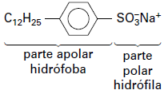

     Em uma planície, ocorreu um acidente ambiental em decorrência do derramamento de grande quantidade de um hidrocarboneto que se apresenta na forma pastosa à temperatura ambiente. Um químico ambiental utilizou uma quantidade apropriada de uma solução de para-dodecil-benzenossulfonato de sódio, um agente tensoativo sintético, para diminuir os impactos desse acidente.

Essa intervenção produz resultados positivos para o ambiente porque

- [ ] promove uma reação de substituição no hidrocarboneto, tornando-o menos letal ao ambiente.
- [ ] a hidrólise do para-dodecil-benzenossulfonato de sódio produz energia térmica suficiente para vaporizar o hidrocarboneto.
- [ ] a mistura desses reagentes provoca a combustão do hidrocarboneto, o que diminui a quantidade dessa substância na natureza.
- [x] a solução de para-dodecil-benzenossulfonato possibilita a solubilização do hidrocarboneto.
- [ ] o reagente adicionado provoca uma solidificação do hidrocarboneto, o que facilita sua retirada do ambiente.

O para-dodecil-benzenossulfonato de sódio é um agente tensoativo sintético, popularmente conhecido como detergente, e apresenta a seguinte fórmula estrutural:

Os hidrocarbonetos, compostos formados por carbono e hidrogênio, são apolares.

Como o detergente apresenta uma parte apolar, pode dissolver os hidrocarbonetos.

        