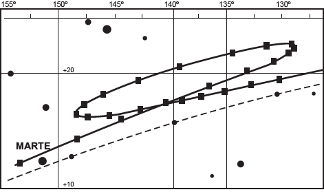
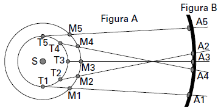
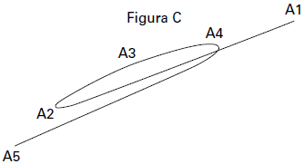

     A característica que permite identificar um planeta no céu é o seu movimento relativo às estrelas fixas. Se observarmos a posição de um planeta por vários dias, verificaremos que sua posição em relação às estrelas fixas se modifica regularmente. A figura destaca o movimento de Marte observado em intervalos de 10 dias, registrado da Terra.

**Projecto Física**. Lisboa: Fundação Calouste Gulbenkian, 1980 (adaptado).

Qual a causa da forma da trajetória do planeta Marte registrada na figura?

- [x] A maior velocidade orbital da Terra faz com que, em certas épocas, ela ultrapasse Marte.
- [ ] A presença de outras estrelas faz com que sua trajetória seja desviada por meio da atração gravitacional.
- [ ] A órbita de Marte, em torno do Sol, possui uma forma elíptica mais acentuada que a dos demais planetas.
- [ ] A atração gravitacional entre a Terra e Marte faz com que este planeta apresente uma órbita irregular em torno do Sol.
- [ ] A proximidade de Marte com Júpiter, em algumas épocas do ano, faz com que a atração gravitacional de Júpiter interfira em seu movimento.

Como a Terra está mais próxima do Sol que Marte, sua velocidade orbital é maior. A figura “A” representa as posições da Terra (T) e de Marte (M) nos mesmos instantes em relação ao Sol.

Considerando-se um observador na Terra, ele visualizará as diferentes posições ocupadas por Marte como ilustrado nas figuras “B” e “C”.

Portanto a forma da trajetória é devido às diferentes velocidades orbitais da Terra e de Marte.

