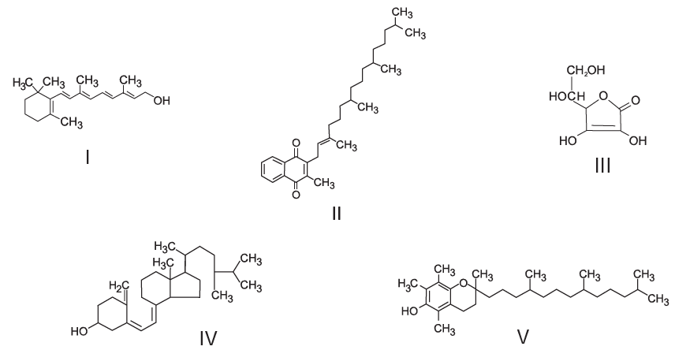

     O armazenamento de certas vitaminas no organismo apresenta grande dependência de sua solubilidade. Por exemplo, vitaminas hidrossolúveis devem ser incluídas na dieta diária, enquanto vitaminas lipossolúveis são armazenadas em quantidades suficientes para evitar doenças causadas pela sua carência. A seguir são apresentadas as estuturas químicas de cinco vitaminas necessárias ao organismo.

Dentre as vitaminas apresentadas na figura, aquela que necessita de maior suplementação diária é

- [ ] I.
- [ ] II.
- [x] III.
- [ ] IV.
- [ ] V.

De acordo com o enunciado, vitaminas hidrossolúveis necessitam ser suplementadas diariamente.

Dentre as vitaminas citadas, a III é a mais hidrossolúvel por apresentar maior quantidade de hidroxilas em sua estrutura, favorecendo sua solubilidade na água, devido à formação de mais ligações de hidrogênio.

        