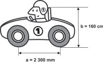

     Um mecânico de uma equipe de corrida necessita que as seguintes medidas realizadas em um carro sejam obtidas em metros:

     a) distância **a **entre os eixos dianteiro e traseiro;

     b) altura **b **entre o solo e o encosto do piloto.

Ao optar pelas medidas **a **e **b **em metros, obtêm-se, respectivamente,

- [ ] 0,23 e 0,16.
- [x] 2,3 e 1,6.
- [ ] 23 e 16.
- [ ] 230 e 160.
- [ ] 2 300 e 1 600.

1 000 mm       1 m\
2 300 mm       a

a = 2,3 m

100 cm       1 m\
160 cm       b

b = 1,6 m
