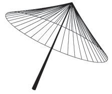

A figura seguinte mostra um modelo de sombrinha muito usado em países orientais.

Disponível em: http://mdmat.psico.ufrgs.br. Acesso em: 1 maio 2010.

Esta figura é uma representação de uma superfície de revolução chamada de

- [ ] pirâmide.
- [ ] semiesfera.
- [ ] cilindro.
- [ ] tronco de cone.
- [x] cone.

A figura mostra a superfície lateral de um cone de revolução.
