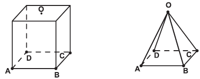
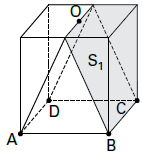
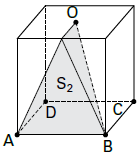

Uma indústria fabrica brindes promocionais em forma de pirâmide. A pirâmide é obtida a partir de quatro cortes em um sólido que tem a forma de um cubo. No esquema, estão indicados o sólido original (cubo) e a pirâmide obtida a partir dele.

Os pontos A, B, C, D e O do cubo e da pirâmide são os mesmos. O ponto O é central na face superior do cubo. Os quatro cortes saem de O em direção às arestas $\overline{AD}$, $​​​​\overline{BC}$   $​​​​\overline{AB}$ ,$​​​​\overline{CD}$ nessa ordem.   Após os cortes, são descartados quatro sólidos.

Os formatos dos sólidos descartados são

- [ ] todos iguais.
- [ ] todos diferentes.
- [ ] três iguais e um diferente.
- [ ] apenas dois iguais.
- [x] iguais dois a dois.

\
Dois sólidos iguais a $S\_1$

\
Dois sólidos iguais a $S\_2$

        