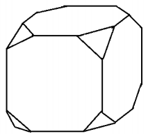

# q
Para o modelo de um troféu foi escolhido um poliedro P, obtido a partir de cortes nos vértices de um cubo. Com um corte plano em cada um dos cantos do cubo, retira-se o canto, que é um tetraedro de arestas menores do que metade da aresta do cubo. Cada face do poliedro P, então, é pintada usando uma cor distinta das demais faces.

Com base nas informações, qual é a quantidade de cores que serão utilizadas na pintura das faces do troféu?

# a
6

# b
8

# c
14

# d
24

# e
30

# r
c

# s
Ao retirar os tetraedros do cubo, teremos um poliedro com 6 faces octogonais e 8 faces triangulares. Assim, serão necessários 14 cores para pintar todas as faces.

 

