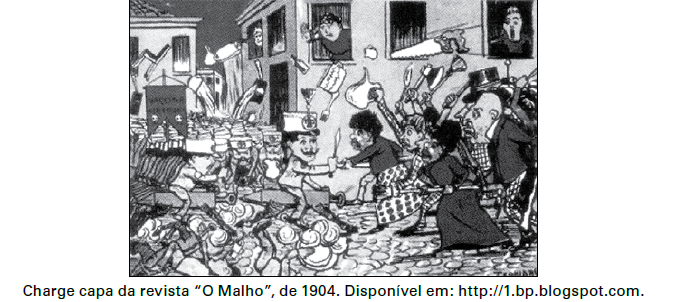

A imagem representa as manifestações nas ruas da cidade do Rio de Janeiro, na primeira década do século XX, que integraram a Revolta da Vacina. Considerando o contexto político-social da época, essa revolta revela

- [x] a insatisfação da população com os benefícios de uma modernização urbana autoritária.
- [ ] a consciência da população pobre sobre a necessidade de vacinação para a erradicação das epidemias.
- [ ] a garantia do processo democrático instaurado com a República, através da defesa da liberdade de expressão da população.
- [ ] o planejamento do governo republicano na área de saúde, que abrangia a população em geral.
- [ ] o apoio ao governo republicano pela atitude de vacinar toda a população em vez de privilegiar a elite.

A charge remonta à Revolta da Vacina na cidade do Rio de Janeiro, durante o governo de Rodrigues Alves (1902-1906). O conflito ocorreu sobretudo, entre a população de baixa renda e as forças policiais (que a imagem mostra montadas em ampolas e agindo de modo repressivo). O estopim da Revolta foi a vacinação obrigatória (determinada pelo diretor da saúde pública Osvaldo Cruz, que visava erradicar a varíola) e na reurbanização da cidade do Rio de Janeiro (processo que afastou a população mais pobre para áreas mais distantes, como encostas de morros e baixada fluminense).
