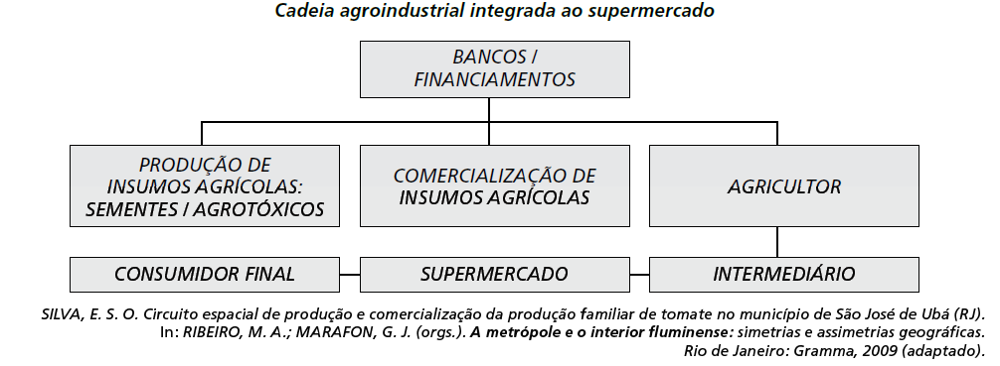

# q

O organograma apresenta os diversos atores que integram uma cadeia agroindustrial e a intensa relação entre os setores primário, secundário e terciário. Nesse sentido, a disposição dos atores na cadeia agroindustrial demonstra

# a
a autonomia do setor primário.

# b
a importância do setor financeiro.

# c
o distanciamento entre campo e cidade.

# d
a subordinação da indústria à agricultura.

# e
a horizontalidade das relações produtivas.

# r
b

# s
A disposição do setor financeiro (Bancos/financiamentos), no topo do organograma, retrata o seu destaque na cadeia produtiva agroindustrial, o que define a alternativa correta, a qual aponta a importância do setor financeiro.
