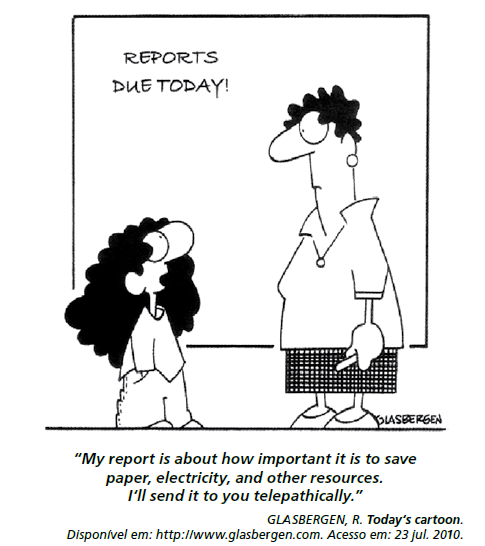

Na fase escolar, é prática comum que os professores passem atividades extraclasse e marquem uma data para que as mesmas sejam entregues para correção. No caso da cena da charge, a professora ouve uma estudante apresentando argumentos para

- [ ] discutir sobre o conteúdo do seu trabalho já entregue.
- [ ] elogiar o tema proposto para o relatório solicitado.
- [ ] sugerir temas para novas pesquisas e relatórios
- [ ] reclamar do curto prazo para entrega do trabalho.
- [x] convencer de que fez o relatório solicitado.

A charge diz que o prazo final de entrega dos trabalhos é “hoje”. A estudante diz que seu trabalho trata da importância de economizar papel, eletricidade e outros recursos e que ela o enviará telepaticamente.
