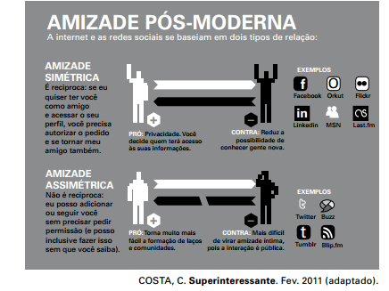

Os amigos são um dos principais indicadores de bem-estar na vida social das pessoas. Da mesma forma que em outras áreas, a internet também inovou as maneiras de vivenciar a amizade. Da leitura do infográfico, depreendem-se dois tipos de amizade virtual, a simétrica e a assimétrica, ambas com seus prós e contras. Enquanto a primeira se baseia na relação de reciprocidade, a segunda

- [ ] reduz o número de amigos virtuais, ao limitar o acesso à rede.
- [ ] parte do anonimato obrigatório para se difundir
- [ ] reforça a configuração de laços mais profundos de amizade
- [x] facilita a interação entre pessoas em virtude de interesses comuns.
- [ ] tem a responsabilidade de promover a proximidade física.

O infográfico da revista Superinteressante apresenta como um motivo em favor da amizade assimétrica o seguinte enunciado: “torna muito mais fácil a formação de laços e comunidades”. Como as comunidades da internet se organizam em torno de interesses comuns, conclui-se que a amizade assimétrica “facilita a interação entre pessoas em virtude de interesses comuns”, tal como se afirma na alternativa D.

        