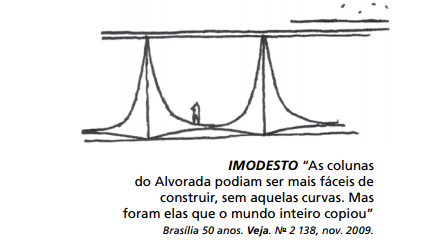

Utilizadas desde a Antiguidade, as colunas, elementos verticais de sustentação, foram sofrendo modificações e incorporando novos materiais com ampliação de possibilidades. Ainda que as clássicas colunas gregas sejam retomadas, notáveis inovações são percebidas, por exemplo, nas obras de Oscar Niemeyer, arquiteto brasileiro nascido no Rio de Janeiro em 1907. No desenho de Niemeyer, das colunas do Palácio da Alvorada, observa-se

- [ ] a presença de um capitel muito simples, reforçando a sustentação.
- [x] o traçado simples de amplas linhas curvas opostas, resultando em formas marcantes.
- [ ] a disposição simétrica das curvas, conferindo saliência e distorção à base.
- [ ] a oposição de curvas em concreto, configurando certo peso e rebuscamento.
- [ ] o excesso de linhas curvas, levando a um exagero na ornamentação.

No projeto do Palácio da Alvorada, Oscar Niemeyer elaborou colunas sem capitel (ornamentação da extremidade superior de uma coluna ou pilastra) e acrescentou traços curvos, características marcantes de seu estilo.

        