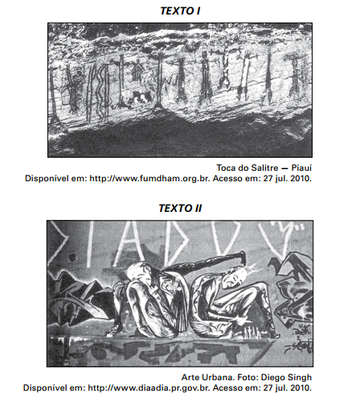

O grafite contemporâneo, considerado em alguns momentos como uma arte marginal, tem sido comparado às pinturas murais de várias épocas e às escritas pré-históricas. Observando as imagens apresentadas, é possível reconhecer elementos comuns entre os tipos de pinturas murais, tais como

- [ ] a preferência por tintas naturais, em razão de seu efeito estético.
- [ ] a inovação na técnica de pintura, rompendo com modelos estabelecidos.
- [x] o registro do pensamento e das crenças das sociedades em várias épocas.
- [ ] a repetição dos temas e a restrição de uso pelas classes dominantes.
- [ ] o uso exclusivista da arte para atender aos interesses da elite.

As pinturas rupestres encontradas na Toca do Salitre e o grafite têm como elemento comum a representação da sociedade por meio da ilustração dos costumes e valores que a estruturam.
