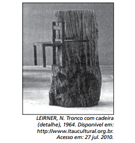

Nessa estranha dignidade e nesse abandono, o objeto foi exaltado de maneira ilimitada e ganhou um significado que se pode considerar mágico. Daí sua “vida inquietante e absurda”. Tornou-se ídolo e, ao mesmo tempo, objeto de zombaria. Sua realidade intrínseca foi anulada. JAFFÉ, A. O simbolismo nas artes plásticas.

In: JUNG, C. G. (org.). O homem e os seus símbolos. Rio de Janeiro: Nova Fronteira, 2008.

A relação observada entre a imagem e o texto apresentados permite o entendimento da intenção de um artista contemporâneo. Neste caso, a obra apresenta características

- [ ] funcionais e de sofisticação decorativa.
- [ ] futuristas e do abstrato geométrico.
- [ ] construtivistas e de estruturas modulares.
- [x] abstracionistas e de releitura do objeto.
- [ ] figurativas e de representação do cotidiano.

A escultura de Nelson Leirner confere sacralidade e permanência (associadas ao tronco) a um objeto do cotidiano (a cadeira), recolocando a cadeira em um contexto distinto daquele que lhe é habitual. Em razão disso, pode-se falar em uma “releitura do objeto”. O resultado escultórico distancia-se de uma representação figurativa (no sentido de realista), tendendo a aproximar-se do abstracionismo (no sentido de um desligamento da representação realista).

        