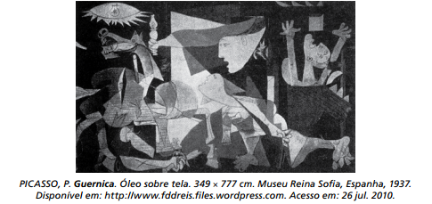

# q

O pintor espanhol Pablo Picasso (1881-1973), um dos mais valorizados no mundo artístico, tanto em termos financeiros quanto históricos, criou a obra Guernica em protesto ao ataque aéreo à pequena cidade basca de mesmo nome. A obra, feita para integrar o Salão Internacional de Artes Plásticas de Paris, percorreu toda a Europa, chegando aos EUA e instalando-se no MoMA, de onde sairia apenas em 1981. Essa obra cubista apresenta elementos plásticos identificados pelo

# a
painel ideográfico, monocromático, que enfoca várias dimensões de um evento, renunciando à realidade, colocando-se em plano frontal ao espectador.

# b
horror da guerra de forma fotográfica, com o uso da perspectiva clássica, envolvendo o espectador nesse exemplo brutal de crueldade do ser humano.

# c
uso das formas geométricas no mesmo plano, sem emoção e expressão, despreocupado com o volume, a perspectiva e a sensação escultórica.

# d
esfacelamento dos objetos abordados na mesma narrativa, minimizando a dor humana a serviço da objetividade, observada pelo uso do claro-escuro.

# e
uso de vários ícones que representam personagens fragmentados bidimensionalmente, de forma fotográ- fica livre de sentimentalismo.

# r
a

# s
A obra Guernica, do pintor espanhol Pablo Picasso, é representativa da estética cubista, manifestação da vanguarda artística do início do século XX que buscava a representação pictórica por meio das formas geométricas e da substituição da perspectiva única, predominante na arte clássica, pela representação fraturada da realidade. A imagem do quadro é retratada em espaço plano, frontal e simultâneo, no qual tudo ocorre ao mesmo tempo. Os tons de preto e cinza dão o caráter monocromático da obra.
