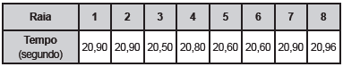

Em uma seletiva para a final dos 100 metros livres de natação, numa olimpíada, os atletas, em suas respectivas raias, obtiveram os seguintes tempos:

A mediana dos tempos apresentados no quadro é

- [ ] 20,70.
- [ ] 20,77.
- [ ] 20,80.
- [x] 20,85.
- [ ] 20,90.

Em ordem crescente, os tempos, em segundos, são 20,50; 20,60; 20,60; 20,80; 20,90, 20,90; 20,90 e 20,96. Os dois termos centrais deste rol são 20,80 e 20,90 e, portanto, a mediana é

 

$\cfrac{20,80 +20,90}{2} = 20,85$

        