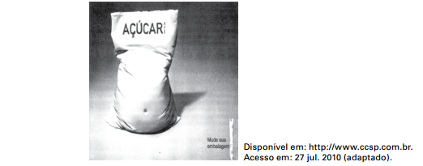

O texto é uma propaganda de um adoçante que tem o seguinte mote: “Mude sua embalagem”. A estratégia que o autor utiliza para o convencimento do leitor baseia-se no emprego de recursos expressivos, verbais e não verbais, com vistas a

- [ ] ridicularizar a forma física do possível cliente do produto anunciado, aconselhando-o a uma busca de mudanças estéticas.
- [ ] enfatizar a tendência da sociedade contemporânea de buscar hábitos alimentares saudáveis, reforçando tal postura.
- [ ] criticar o consumo excessivo de produtos industrializados por parte da população, propondo a redução desse consumo.
- [x] associar o vocábulo “açúcar” à imagem do corpo fora de forma, sugerindo a substituição desse produto pelo adoçante.
- [ ] relacionar a imagem do saco de açúcar a um corpo humano que não desenvolve atividades físicas, incentivando a prática esportiva.

A propaganda é um texto sincrético, ou seja, resulta da articulação de elementos verbais e visuais. O sentido, nesse gênero, é produzido pela relação entre os dois textos de natureza distinta. A imagem do saco de açúcar é antropomorfizada, isto é, tem traços humanos: parece uma barriga fora de forma. O elemento verbal, a palavra açúcar, portanto, passa a ter valor negativo: é sugerida uma relação de causa-efeito. Em outros termos, o consumo do açúcar prejudica a forma física, razão pela qual o produto deve ser substituído pelo adoçante (“Mude sua embalagem”).
