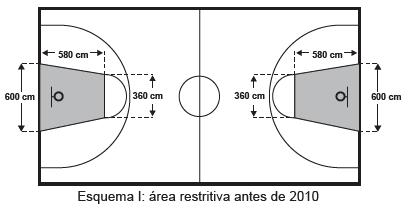
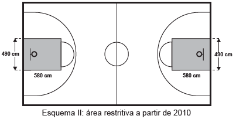

O Esquema I mostra a configuração de uma quadra de basquete. Os trapézios em cinza, chamados de garrafões, correspondem a áreas restritivas.

Visando atender as orientações do Comitê Central da Federação lnternacional de Basquete (Fiba) em 2010, que unificou as marcações das diversas ligas, foi prevista uma modificação nos garrafões das quadras, que passariam a ser retângulos, como mostra o Esquema II.

Após executadas as modificações previstas, houve uma alteração na área ocupada por cada garrafão, que corresponde a um(a)

 

- [x] aumento de 5.800 $cm^2$.
- [ ] aumento de 75.400 $cm^2$.
- [ ] aumento de 214.600 $cm^2$.
- [ ] diminuição de 63.800 $cm^2$.
- [ ] diminuição de 272.600 $cm^2$.

I) A área do trapézio do esquema I, em $cm^2$, é : $\cfrac{(600+360 \cdot 580)}{2} = 278.400$

 

II) A área do retângulo do esquema II, em $cm^2$, é 580 . 490 = 284.200

 

III) O aumento da área, em $cm^2$, foi de 284.200 – 278.400 = 5.800
