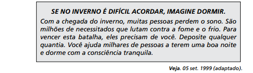

O produtor de anúncios publicitários utiliza-se de estratégias persuasivas para influenciar o comportamento de seu leitor. Entre os recursos argumentativos mobilizados pelo autor para obter a adesão do público à campanha, destaca-se nesse texto

- [ ] a oposição entre individual e coletivo, trazendo um ideário populista para o anúncio.
- [ ] a utilização de tratamento informal com o leitor, o que suaviza a seriedade do problema.
- [ ] o emprego de linguagem figurada, o que desvia a atenção da população do apelo financeiro
- [ ] o uso dos numerais “milhares” e “milhões”, responsável pela supervalorização das condições dos necessitados.
- [x] o jogo de palavras entre “acordar” e “dormir”, o que relativiza o problema do leitor em relação ao dos necessitados.

A propaganda é um texto em que predomina a função apelativa da linguagem. É voltado, portanto, predominantemente para o interlocutor. No caso, procura sensibilizar os mais favorecidos para um problema que atinge os menos favorecidos. Partindo da ideia de que no inverno é mais difícil acordar, uma vez que se está abrigado, protegido no calor do lar, faz o público dar atenção a quem tem outro problema no inverno, que é não conseguir dormir em razão do frio. Assim, o jogo entre o “acordar” e o “dormir” é que dá ao inverno diferentes significados, mostrando que é mais difícil não conseguir dormir do que acordar nessa estação.

        