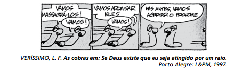

# q

O humor da tira decorre da reação de uma das cobras com relação ao uso de pronome pessoal reto, em vez de pronome oblíquo. De acordo com a norma-padrão da língua, esse uso é inadequado, pois

# a
contraria o uso previsto para o registro oral da língua

# b
contraria a marcação das funções sintáticas de sujeito e objeto.

# c
gera inadequação na concordância com o verbo.

# d
gera ambiguidade na leitura do texto.

# e
apresenta dupla marcação de sujeito

# r
b

# s
Na frase “Vamos arrasar eles”, o pronome pessoal do caso reto eles foi empregado como objeto direto da locução verbal vamos arrasar, contrariando uma norma da língua culta formal segundo a qual esse caso do pronome (eu, tu, ele/ela, nós, vós, eles/elas) serve para marcar a função sintática de sujeito. Portanto, em norma culta, assim se redigiria a fala do segundo quadrinho: vamos arrasá-los.
