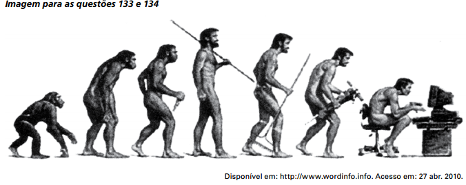

O argumento presente na charge consiste em uma metáfora relativa à teoria evolucionista e ao desenvolvimento tecnológico. Considerando o contexto apresentado, verifica-se que o impacto tecnológico pode ocasionar

- [x] o surgimento de um homem dependente de um novo modelo tecnológico.
- [ ] a mudança do homem em razão dos novos inventos que destroem sua realidade.
- [ ] a problemática social de grande exclusão digital a partir da interferência da máquina
- [ ] a invenção de equipamentos que dificultam o trabalho do homem, em sua esfera social.
- [ ] o retrocesso do desenvolvimento do homem em face da criação de ferramentas como lança, máquina e computador

As imagens que compõem a charge figurativizam a noção de que os processos de desenvolvimento e retrocesso do homem são resultado do impacto tecnológico de diferentes momentos históricos. As posturas dos corpos dos quatro primeiros indivíduos formam uma linha ascendente, que culmina no homem com lança, ponto mais alto da evolução, segundo o chargista. Como se fosse um espelho dessa primeira parte, as posturas dos três últimos indivíduos (acompanhados de um rastelo, de uma britadeira e de um computador) descrevem uma linha decrescente: o desenvolvimento humano passou a retroceder à medida que a mecanização (do campo e das indústrias) e as tecnologias de informação foram incorporadas às sociedades. Portanto, é possível afirmar, de maneira bem ampla, que a charge se fundamenta no argumento de que o homem está se tornando, cada vez mais, dependente dos novos modelos tecnológicos que cria.

        