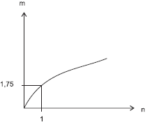
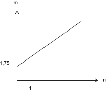
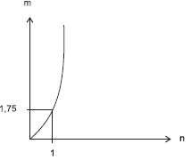
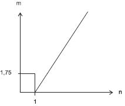
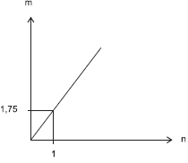
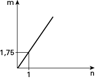

     As frutas que antes se compravam por dúzias, hoje em dia, podem ser compradas por quilogramas, existindo também a variação dos preços de acordo com a época de produção. Considere que, independente da época ou variação de preço, certa fruta custa R$ 1,75 o quilograma.

Dos gráficos a seguir, o que representa o preço m pago em reais pela compra de n quilogramas desse produto é

- [ ] 
- [ ] 
- [ ] 
- [ ] 
- [x] 

Do enunciado, temos que m = 1,75n

Esboçando o gráfico de m em função de n vem:

        