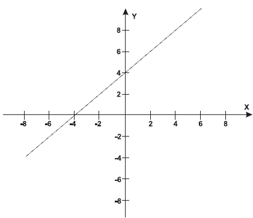

     Um bairro de uma cidade foi planejado em uma região plana, com ruas paralelas e perpendiculares, delimitando quadras de mesmo tamanho. No plano de coordenadas cartesianas seguinte, esse bairro localiza-se no segundo quadrante, e as distâncias nos eixos são dadas em quilômetros.

     A reta de equação y = x + 4 representa o planejamento do percurso da linha do metrô subterrâneo que atravessará o bairro e outras regiões da cidade. No ponto P = (-5, 5), localiza-se um hospital público. A comunidade solicitou ao comitê de planejamento que fosse prevista uma estação do metrô de modo que sua distância ao hospital, medida em linha reta, não fosse maior que 5 km. 

Atendendo ao pedido da comunidade, o comitê argumentou corretamente que isso seria automaticamente satisfeito, pois já estava prevista a construção de uma estação no ponto

- [ ] (–5, 0).
- [x] (–3, 1).
- [ ] (–2, 1).
- [ ] (0, 4).
- [ ] (2, 6).

Dentre as alternativas apresentadas, apenas os pontos B(–3, 1), D(0, 4) e E(2, 6) pertencem à reta de equação y = x + 4, podendo representar a localização da estação. Calculando as distâncias de cada um desses pontos ao ponto P(–5, 5), temos:

$PB = \sqrt{(-5 +3)^2 + (5-1)^2} = \sqrt{20}$

$PD = \sqrt{(-5 +0)^2 + (5-4)^2} = \sqrt{26}$

$PE = \sqrt{(-5 - 2)^2 + (5-6)^2} = \sqrt{50}$

Como $\sqrt{20} < 5$, conclui-se que já estava prevista a construção de uma estação no ponto B(–3, 1).

        