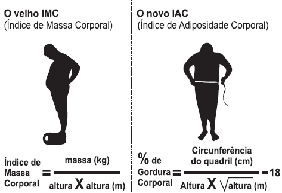

# q
     O Índice de Massa Corporal (IMC) é largamente utilizado há cerca de 200 anos, mas esse cálculo representa muito mais a corpulência que a adiposidade, uma vez que indivíduos musculosos e obesos podem apresentar o mesmo IMC. Uma nova pesquisa aponta o Índice de Adiposidade Corporal (IAC) como uma alternativa mais fidedigna para quantificar a gordura corporal, utilizando a medida do quadril e a altura. A figura mostra como calcular essas medidas, sabendo-se que, em mulheres, a adiposidade normal está entre 19% e 26%.

Uma jovem com IMC = $20 kg/m^2$, 100 cm de circunferência dos quadris e 60 kg de massa corpórea resolveu averiguar seu IAC. Para se enquadrar aos níveis de normalidade de gordura corporal, a atitude adequada que essa jovem deve ter diante da nova medida é

(Use $\sqrt{3} = 1,7$ e $\sqrt{1,7} = 1,3$)

# a
reduzir seu excesso de gordura em cerca de 1%.

# b
reduzir seu excesso de gordura em cerca de 27%.

# c
manter seus níveis atuais de gordura.

# d
aumentar seu nível de gordura em cerca de 1%.

# e
aumentar seu nível de gordura em cerca de 27%.

# r
a

# s
Da fórmula do IMC, sendo h a altura, em metros, temos:

$20 = \cfrac{60}{h^2}$

$h^2 = 3$

$h = \sqrt{3}$

ou seja h = 1,7 (metros).

Da fórmula IAC, sendo p% a porcentagem de gordura corporal, temos:

$p =\cfrac{100}{1,7 \cdot \sqrt{1,7}} - 18$

$p = \cfrac{100}{1,7 \cdot 1,3} -18 = 27,25$

Como, para atingir a normalidade, ela deve ter IAC de 26%, a redução deve ser:

27,25 – 26 = 1,25 (pontos percentuais)

Assim, seu IAC deve ser reduzido em cerca de 1 ponto percentual.

Vamos admitir que reduzir o excesso de gordura em 1% significa reduzir o IAC em 1 ponto percentual.
