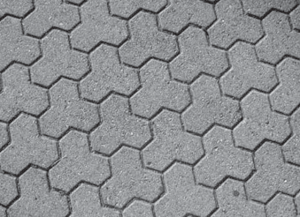
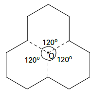

Disponível em: http://www.diaadia.pr.gov.br. Acesso em: 28 abr. 2010.

O polígono que dá forma a essa calçada é invariante por rotações, em torno de seu centro, de

- [ ] 45°.
- [ ] 60°.
- [ ] 90º.
- [x] 120°.
- [ ] 180°.

A figura a seguir mostra o polígono que dá forma à calçada, com seu centro O identificado.

Assim, o polígono é invariante por rotações de 120º em torno de seu centro.

        