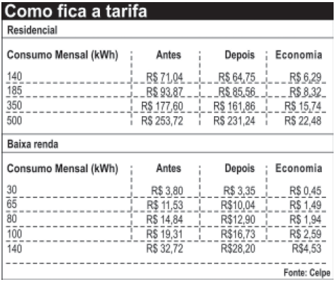

A tabela compara o consumo mensal, em kWh, dos consumidores residenciais e dos de baixa renda, antes e depois da redução da tarifa de energia no estado de Pernambuco.

**Diário de Pernambuco.** 28 abr. 2010 (adaptado).

Considere dois consumidores: um que é de baixa renda e gastou 100 kWh e outro do tipo residencial que gastou 185 kWh. A diferença entre o gasto desses consumidores com 1 kWh, depois da redução da tarifa de energia, mais aproximada, é de

- [ ] R$ 0,27.
- [x] R$ 0,29.
- [ ] R$ 0,32.
- [ ] R$ 0,34.
- [ ] R$ 0,61.

Os gastos por kWh depois da redução são:

**• Residencial**

$\cfrac{85,56}{185} = 0,4624$ reais.

**• Baixa renda**

$\cfrac{16,76}{100} = 0,1673$ reais.

Assim, a diferença é

0,4624 – 0,1672 = 0,2952

ou seja, aproximadamente R$ 0,29.

        