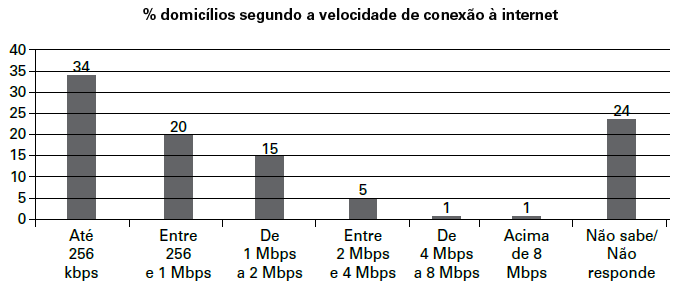

O gráfico mostra a velocidade de conexão à internet utilizada em domicílios no Brasil. Esses dados são resultado da mais recente pesquisa, de 2009, realizada pelo Comitê Gestor da Internet (CGI).

Disponível em: http://agencia.ipea.gov.br. Acesso em: 28 abr. 2010 (adaptado).

Escolhendo-se, aleatoriamente, um domicílio pesquisado, qual a chance de haver banda larga de conexão de pelo menos 1 Mbps neste domicílio?

- [ ] 0,45
- [ ] 0,42
- [ ] 0,30
- [x] 0,22
- [ ] 0,15

Dos dados apresentados no gráfico, temos que (15 + 5 + 1 + 1)%, ou seja, exatamente 22% dos domicílios têm pelo menos 1 Mbps de velocidade de conexão à internet.

Ainda do gráfico, 24% dos domicílios não sabem ou não responderam, portanto nada se pode afirmar a respeito de sua velocidade de conexão. Ela pode ser menor, igual ou maior que 1 Mbps. Pode ainda não haver acesso à internet.

Assim, a chance — entendida aqui como sinônimo de probabilidade — é qualquer valor p, com$22\\% \leq p \leq 46\\%$. Logo, a questão não apresenta alternativa correta. Porém, a banca do ENEM considerou a alternativa correta como a letra D.
