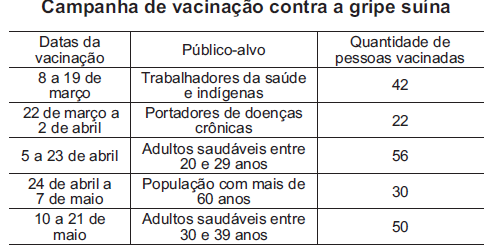

     Todo o país passa pela primeira fase de campanha de vacinação contra a gripe suína (H1N1). Segundo um médico infectologista do Instituto Emílio Ribas, de São Paulo, a imunização “deve mudar”, no país, a história da epidemia. Com a vacina, de acordo com ele, o Brasil tem a chance de barrar uma tendência do crescimento da doença, que já matou 17 mil no mundo. A tabela apresenta dados específicos de um único posto de vacinação.

Disponível em: http://img.terra.com.br. Acesso em: 26 abr. 2010 (adaptado).

Escolhendo-se aleatoriamente uma pessoa atendida nesse posto de vacinação, a probabilidade de ela ser portadora de doença crônica é

- [ ] 8%.
- [ ] ‘›‘›9%.
- [x] 11%.
- [ ] 12%.
- [ ] 22%.

Da tabela temos que o total de pessoas vacinadas é 200, das quais 22 apresentam doença crônica. Logo a probabilidade pedida é $\cfrac{22}{200}$, ou seja, 11%.

        